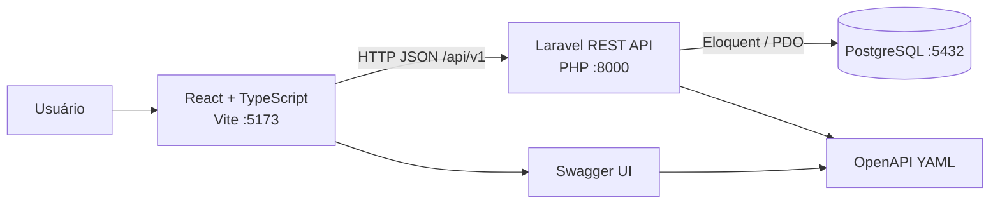

# Arquitetura e operação

## Visão geral

O V-Lab é um monólito modular full stack para registrar e acompanhar
solicitações fictícias de atendimento em saúde pública. A separação de
responsabilidades permite evoluir cada camada sem permitir que a interface
contorne as regras do domínio.

Em desenvolvimento, o Docker Compose inicializa `db`, `backend` e `frontend`
com healthchecks. O código do backend é incorporado na imagem para evitar a
latência de bind mount no filesystem compartilhado do Windows.

## Limites entre as camadas

### Frontend

O React gerencia navegação, estado de tela, filtros, paginação, validações
ergonômicas e mensagens de erro. O cliente HTTP centraliza a URL da API e
serializa JSON. O frontend **não** conhece credenciais, acessa PostgreSQL ou
decide regras de autorização/transição: validações locais são apenas feedback
rápido para o usuário.

### API Laravel

Laravel é o limite de confiança e a autoridade do domínio. Controllers
traduzem HTTP, Form Requests validam entrada, Services concentram protocolo,
prioridade e transições, e Models/Eloquent persistem dados. Respostas e erros
são JSON versionados em `/api/v1`; a interface nunca deve depender de tabelas
ou detalhes internos do banco.

Regras essenciais:

- protocolo único gerado no servidor;
- status inicial `RECEBIDA`;
- prioridade `URGENTE` exige justificativa;
- transições são validadas no backend;
- cadastro é transacional.

### Banco

PostgreSQL é o armazenamento de produção/desenvolvimento via Compose. Migrations
versionam o schema e índices sustentam os filtros mais usados. O banco não é
exposto ao navegador. Testes de Laravel usam SQLite em memória/arquivo para
serem determinísticos e rápidos; isso não substitui a validação do schema
PostgreSQL no ambiente de execução.

## Decisões arquiteturais

1. **Monólito modular antes de microserviços:** o volume e o domínio atual não
   justificam rede, observabilidade e consistência distribuída adicionais.
2. **Regras no servidor:** evita divergência entre clientes e permite adicionar
   outros consumidores sem duplicar o domínio.
3. **API versionada e contrato OpenAPI:** mudanças incompatíveis podem receber
   uma nova versão e o contrato pode ser validado/consumido por ferramentas.
4. **Sem DELETE no escopo atual:** o fluxo operacional preserva histórico;
   cancelamento é uma transição de status.
5. **PostgreSQL persistente e seed fictício idempotente:** reinícios mantêm os
   dados, enquanto a demonstração pode ser recriada sem duplicidade.

## Evolução para serviços por domínio

Quando houver necessidade real de escala ou autonomia, separar por capacidades,
sem começar repartindo tabelas:

1. extrair módulos internos (Solicitações, Agenda, Notificações e Relatórios)
   com interfaces e eventos explícitos;
2. definir ownership: cada serviço passa a ser dono do seu schema, sem JOIN
   remoto ou acesso direto de outro serviço;
3. publicar eventos de integração, como `SolicitacaoCriada`,
   `StatusAtualizado` e `SolicitacaoConcluida`;
4. introduzir outbox/idempotência, rastreabilidade e filas antes de extrair o
   primeiro serviço;
5. colocar um gateway/BFF na frente dos serviços e manter contratos versionados;
6. migrar gradualmente, com leitura dupla/feature flags e plano de rollback.

O candidato natural para a primeira extração é Notificações, por ter
processamento assíncrono e baixa dependência transacional. Solicitações deve
continuar como serviço dono das transições até que seus invariantes estejam
representados por eventos e testes de contrato.

## Operação dos bônus e recursos auxiliares

Os recursos complementares são operacionais, não atalhos para o domínio:

- **Swagger UI:** `http://127.0.0.1:5173/swagger.html`; o YAML canônico está
  em `docs/openapi.yaml` e é servido pela API em `/api/v1/openapi.yaml`.
- **Dashboard/resumo:** `GET /api/v1/solicitacoes/resumo`; os agregados são
  calculados pela API e exibidos pelo React.
- **Dados de demonstração:** `docker exec vlab-backend php artisan db:seed
  --force`; o seeder é idempotente e só usa dados fictícios.
- **Healthchecks:** `db` usa `pg_isready`, Laravel expõe `/up` e Vite responde
  na porta `5173`; consulte `docker compose ps` e os logs para diagnóstico.
- **Persistência/reset:** `docker compose down` preserva o volume
  `postgres_data`; `docker compose down -v` remove dados locais e deve ser
  usado conscientemente.

## Qualidade e CI

O workflow `.github/workflows/ci.yml` executa em paralelo:

- backend: Composer, migrations SQLite, Laravel Pint e PHPUnit;
- frontend: `npm ci`, checagem TypeScript (`npm run lint`), Vitest e build
  de produção.

Credenciais de desenvolvimento do Compose não são segredos de produção. Em
produção, use secrets do ambiente, `APP_DEBUG=false`, migrações controladas,
backups e observabilidade. Mudanças de API devem atualizar simultaneamente
`docs/openapi.yaml`, testes e esta documentação.
